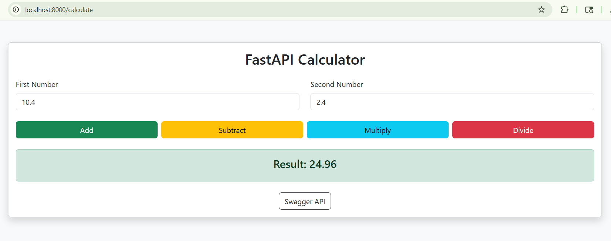
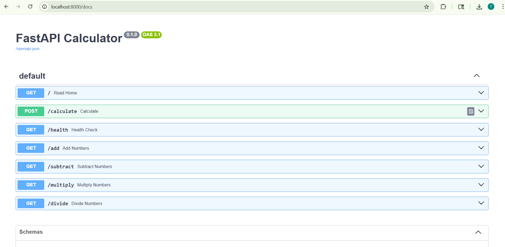
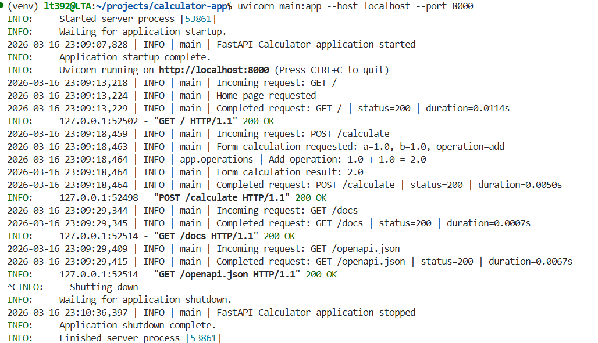
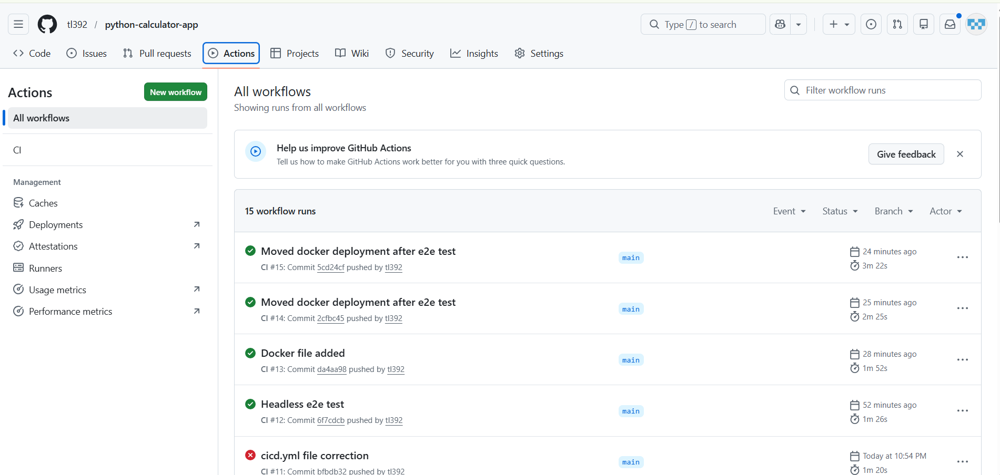
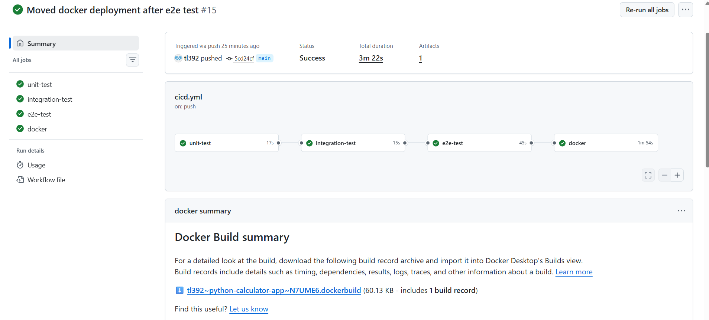
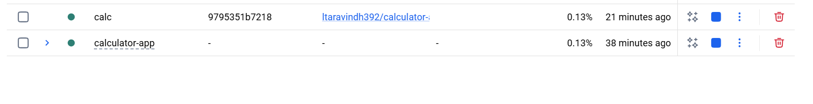

# FastAPI Calculator — End-to-End Setup Guide

## Overview

This project is a **FastAPI-based calculator** with:

- **HTML UI** using Bootstrap
- **FastAPI endpoints** for add, subtract, multiply, and divide
- **Unit tests** with `pytest`
- **Integration tests** with `FastAPI TestClient`
- **End-to-end tests** with **Playwright for Python**
- **Logging** for requests, operations, and errors
- **Docker** support with `Dockerfile` and `docker-compose.yml`
- **GitHub Actions CI/CD**
- **Docker Hub deployment** after tests pass on `main`

---

## Output
Docker HUB Link - [Calculator App](https://hub.docker.com/r/ltaravindh392/calculator-app)
Output Screeshot:






## Project Structure

```text
project-root/
├── app/
│   ├── __init__.py
│   ├── operations.py
│   └── templates/
│         └── index.html
├── tests/
│   ├── conftest.py
│   ├── unit/
│   │   └── test_operations.py
│   ├── integration/
│   │   └── test_main.py
│   └── e2e/
│       └── test_calculator_e2e.py
├── .github/
│   └── workflows/
│       └── ci.yml
├── main.py
├── requirements.txt
├── pytest.ini
├── Dockerfile
├── docker-compose.yml
└── README.md
```

---

## Features

| Feature | Description |
|---|---|
| FastAPI API | Separate endpoints for `/add`, `/subtract`, `/multiply`, `/divide` |
| HTML UI | Bootstrap-based form with operation buttons |
| Unit Tests | Tests arithmetic functions in `app/operations.py` |
| Integration Tests | Tests API and form endpoints in `main.py` |
| E2E Tests | Uses Playwright Python to simulate real browser usage |
| Logging | Tracks requests, operations, results, and errors |
| Docker | Containerized app for local and cloud execution |
| GitHub Actions | Runs test pipeline automatically |
| Docker Hub Deploy | Pushes image after successful CI on `main` |

---

## Requirements

| Tool | Version / Notes |
|---|---|
| Python | 3.11 recommended |
| pip | Latest |
| Node.js | Not required if using Python Playwright only |
| Docker | Latest |
| Docker Compose | `docker compose` plugin |
| Git | Latest |

---

## Python Dependencies

Add these to `requirements.txt`:

```txt
fastapi
uvicorn
jinja2
python-multipart
pytest
pytest-cov
httpx
playwright
pytest-playwright
```

---

## Installation

### Local setup commands

| Step | Command |
|---|---|
| Create virtual environment | `python -m venv venv` |
| Activate on macOS/Linux | `source venv/bin/activate` |
| Activate on Windows | `venv\Scripts\activate` |
| Upgrade pip | `python -m pip install --upgrade pip` |
| Install dependencies | `pip install -r requirements.txt` |
| Install Playwright browsers | `python -m playwright install chromium` |

---

## Run the Application

| Task | Command |
|---|---|
| Start FastAPI locally | `uvicorn main:app --reload` |
| Open homepage | `http://127.0.0.1:8000` |
| Open Swagger UI | `http://127.0.0.1:8000/docs` |
| Open ReDoc | `http://127.0.0.1:8000/redoc` |

---

## Logging Setup

Logging should be implemented in both `main.py` and `app/operations.py`.

### What should be logged

| Area | Example |
|---|---|
| App startup/shutdown | Application started / stopped |
| Incoming requests | `GET /add`, `POST /calculate` |
| Operation inputs | `a=5, b=3, operation=add` |
| Operation results | `result=8` |
| Errors | divide by zero, invalid input |
| Unhandled exceptions | unexpected server errors |

### Recommended log output

- Console output
- File output to `app.log`

---

## Testing Strategy

| Test Type | Purpose | Folder |
|---|---|---|
| Unit | Tests arithmetic functions directly | `tests/unit` |
| Integration | Tests FastAPI endpoints and form submission | `tests/integration` |
| E2E | Tests UI in a real browser | `tests/e2e` |

---

## Pytest Configuration

Use this in `pytest.ini`:

```ini
[pytest]
testpaths = tests

addopts =
    -v
    --cov=main
    --cov=app
    --cov-report=term-missing
    --cov-report=html

python_files = test_*.py *_test.py *_e2e.py
python_classes = Test*
python_functions = test_*

markers =
    unit: unit tests
    integration: integration tests
    e2e: end-to-end tests
    slow: slow tests
    fast: fast tests

filterwarnings =
    ignore::DeprecationWarning
    ignore::PendingDeprecationWarning
    ignore::ResourceWarning

log_level = INFO
```

---

## Test Commands

| Task | Command |
|---|---|
| Run all tests | `pytest` |
| Run unit tests only | `pytest tests/unit -m unit` |
| Run integration tests only | `pytest tests/integration -m integration` |
| Run E2E tests only | `pytest tests/e2e -m e2e` |
| Run E2E with visible browser | `pytest tests/e2e -m e2e --headed` |
| Run E2E with Chromium explicitly | `pytest tests/e2e -m e2e --browser chromium` |
| Show collected tests | `pytest --collect-only` |
| Open coverage HTML report | `htmlcov/index.html` |

> Note: **CI runs headless by default**. Do not add `--headed` in GitHub Actions.

---

## E2E Server Startup

Use `tests/conftest.py` to start FastAPI automatically before Playwright tests.

### Example

```python
import subprocess
import time
import pytest


@pytest.fixture(scope="session")
def server():
    process = subprocess.Popen(
        ["uvicorn", "main:app", "--host", "127.0.0.1", "--port", "8000"]
    )

    time.sleep(2)

    yield

    process.terminate()
    process.wait()
```

This allows E2E tests to run with:

```bash
pytest tests/e2e -m e2e
```

---

## Docker Setup

### Dockerfile

```dockerfile
FROM python:3.11-slim

WORKDIR /app

COPY requirements.txt .

RUN pip install --no-cache-dir --upgrade pip && \
    pip install --no-cache-dir -r requirements.txt && \
    python -m playwright install --with-deps chromium

COPY . .

EXPOSE 8000

CMD ["uvicorn", "main:app", "--host", "0.0.0.0", "--port", "8000"]
```

### docker-compose.yml

```yaml
version: "3.9"

services:
  calculator-app:
    build: .
    container_name: fastapi-calculator
    ports:
      - "8000:8000"
    volumes:
      - .:/app
    restart: unless-stopped
    command: uvicorn main:app --host 0.0.0.0 --port 8000
```

---

## Docker Commands

| Task | Command |
|---|---|
| Build image | `docker compose build` |
| Build and run | `docker compose up --build` |
| Run in background | `docker compose up -d` |
| View running containers | `docker compose ps` |
| View logs | `docker compose logs -f` |
| Stop container | `docker compose stop` |
| Start stopped container | `docker compose start` |
| Kill container immediately | `docker compose kill` |
| Stop and remove container | `docker compose down` |
| Remove container, images, volumes | `docker compose down --rmi all --volumes` |

---

## Git Commands

| Task | Command |
|---|---|
| Initialize repo | `git init` |
| Check status | `git status` |
| Create branch | `git checkout -b feature/tests` |
| Add files | `git add .` |
| Commit changes | `git commit -m "Add FastAPI calculator tests"` |
| Push branch | `git push origin feature/tests` |
| Push main | `git push origin main` |

---

## GitHub Actions CI/CD

### Workflow goals

| Job | Purpose |
|---|---|
| `unit-test` | Run unit tests |
| `integration-test` | Run integration tests |
| `e2e-test` | Run Playwright E2E tests in headless Chromium |
| `dockerhub-deploy` | Build and push Docker image after all tests pass |

### GitHub secrets required

Add these in **GitHub → Settings → Secrets and variables → Actions**:

| Secret Name | Purpose |
|---|---|
| `DOCKERHUB_USERNAME` | Your Docker Hub username |
| `DOCKERHUB_TOKEN` | Docker Hub access token |

> Use a **Docker Hub access token**, not your Docker Hub password.

---

## Example GitHub Actions Workflow

Save as `.github/workflows/ci.yml`:

```yaml
name: CI and Docker Deploy

on:
  push:
    branches: [main]
  pull_request:

permissions:
  contents: read

jobs:
  unit-test:
    runs-on: ubuntu-latest
    steps:
      - uses: actions/checkout@v4
      - uses: actions/setup-python@v5
        with:
          python-version: "3.11"
      - name: Install dependencies
        run: |
          python -m pip install --upgrade pip
          pip install -r requirements.txt
      - name: Run unit tests
        run: pytest tests/unit -m unit

  integration-test:
    runs-on: ubuntu-latest
    needs: unit-test
    steps:
      - uses: actions/checkout@v4
      - uses: actions/setup-python@v5
        with:
          python-version: "3.11"
      - name: Install dependencies
        run: |
          python -m pip install --upgrade pip
          pip install -r requirements.txt
      - name: Run integration tests
        run: pytest tests/integration -m integration

  e2e-test:
    runs-on: ubuntu-latest
    needs: integration-test
    steps:
      - uses: actions/checkout@v4
      - uses: actions/setup-python@v5
        with:
          python-version: "3.11"
      - name: Install dependencies
        run: |
          python -m pip install --upgrade pip
          pip install -r requirements.txt
      - name: Install Playwright browsers
        run: python -m playwright install --with-deps chromium
      - name: Run E2E tests
        run: pytest tests/e2e -m e2e

  dockerhub-deploy:
    runs-on: ubuntu-latest
    needs: e2e-test
    if: github.event_name == 'push' && github.ref == 'refs/heads/main'
    steps:
      - uses: actions/checkout@v4
      - name: Set up Docker Buildx
        uses: docker/setup-buildx-action@v3
      - name: Log in to Docker Hub
        uses: docker/login-action@v3
        with:
          username: ${{ secrets.DOCKERHUB_USERNAME }}
          password: ${{ secrets.DOCKERHUB_TOKEN }}
      - name: Extract Docker metadata
        id: meta
        uses: docker/metadata-action@v5
        with:
          images: ${{ secrets.DOCKERHUB_USERNAME }}/fastapi-calculator
          tags: |
            type=raw,value=latest
            type=sha
      - name: Build and push image
        uses: docker/build-push-action@v6
        with:
          context: .
          push: true
          tags: ${{ steps.meta.outputs.tags }}
          labels: ${{ steps.meta.outputs.labels }}
```

---

## GitHub Actions Security Notes

| Practice | Reason |
|---|---|
| Use secrets | Prevent exposing credentials |
| Use Docker Hub token | Safer than password |
| Limit workflow permissions | Follows least-privilege principle |
| Deploy only from `main` | Avoid accidental pushes from feature branches |
| Keep CI headless | More stable in automation environments |

---

## Docker Hub Deployment Flow

| Step | What Happens |
|---|---|
| Push to `main` | GitHub Actions starts |
| Unit tests pass | Workflow continues |
| Integration tests pass | Workflow continues |
| E2E tests pass | Workflow continues |
| Docker login succeeds | Image build begins |
| Docker image built | Image tagged |
| Docker image pushed | Available on Docker Hub |

---

## Suggested Development Workflow

| Phase | Command / Action |
|---|---|
| Install deps | `pip install -r requirements.txt` |
| Install browser | `python -m playwright install chromium` |
| Start app locally | `uvicorn main:app --reload` |
| Run all tests | `pytest` |
| Run E2E visually | `pytest tests/e2e -m e2e --headed` |
| Build Docker image | `docker compose build` |
| Run app in Docker | `docker compose up` |
| Commit changes | `git add . && git commit -m "Update tests and docker setup"` |
| Push to GitHub | `git push origin main` |
| Check Actions | GitHub Actions tab |
| Verify Docker Hub image | Docker Hub repository |

---

## Troubleshooting

| Problem | Fix |
|---|---|
| `Error loading ASGI app` | Check `uvicorn main:app --reload` and project structure |
| `pytest: unrecognized arguments --cov` | Install `pytest-cov` |
| Playwright browser not launching | Run `python -m playwright install chromium` |
| Headed browser fails in CI | Remove `--headed`; CI should be headless |
| Divide endpoint returns 400 | This is expected for divide-by-zero |
| Docker push fails | Check Docker Hub username/token secrets |

---


## Useful Links

| Resource | URL |
|---|---|
| FastAPI Docs | `https://fastapi.tiangolo.com/` |
| Pytest Docs | `https://docs.pytest.org/` |
| Playwright Python Docs | `https://playwright.dev/python/` |
| Docker Docs | `https://docs.docker.com/` |
| GitHub Actions Docs | `https://docs.github.com/actions` |

---

## Summary

This setup gives you a complete workflow from local development to automated testing and Docker Hub deployment:

1. Build the FastAPI calculator
2. Add logging
3. Write unit, integration, and E2E tests
4. Run everything with `pytest`
5. Containerize with Docker
6. Automate with GitHub Actions
7. Deploy image to Docker Hub
